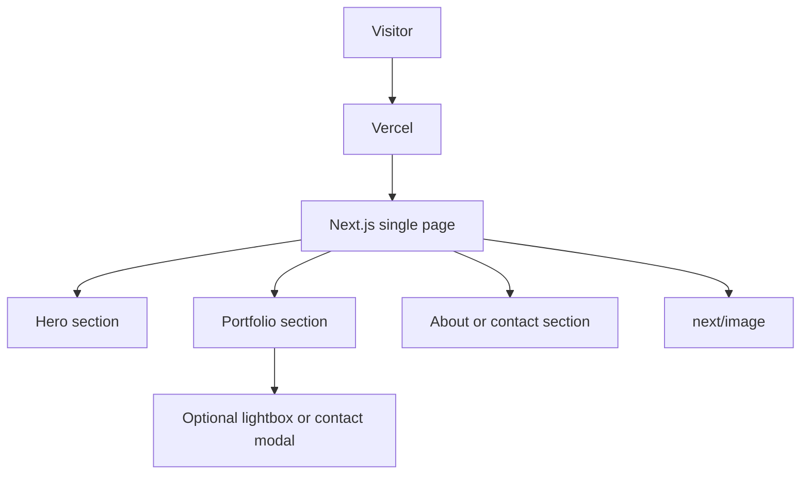

# Site plan

Single-page photography marketing + portfolio site for a photograph company. Hosted on Vercel.

## Page shape

One Next.js page with three sections and optional one modal:

1. **Hero** (`#hero`) — brand, short pitch, CTA
2. **Work / gallery** (`#work`) — portfolio photos via `next/image`
3. **About / contact** (`#contact`) — studio story and how to get in touch

Anchor links in a simple header or CTA jump between sections. No extra routes.

## Modal

At most one modal, used as either:

- a **lightbox** for a selected portfolio photo, or
- a **contact form** overlay

Keep it accessible (focus trap, Escape to close). Prefer Radix Dialog or a small custom dialog.

## Animation

Possible, not required for the first ship.

- Start with CSS (fade/reveal on scroll, modal open/close).
- Add Motion if we need sequenced section entrance, lightbox transitions, or light gallery motion.
- Defer GSAP/Lenis unless we want luxury scroll.

## Deploy

Vercel, pointed at this Next.js app. No separate backend for v1. Forms can start as `mailto:` or a later form service.
